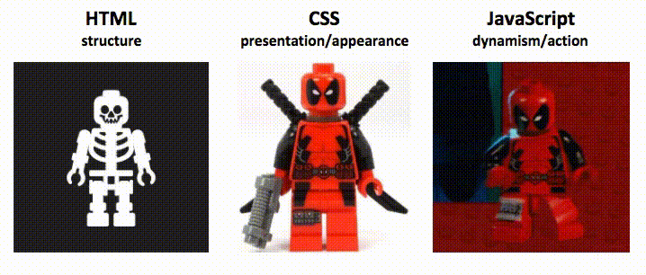

<h1 align="center">Frontend Preparation Kit v1.0</h1>
<h4 align="center">Unlocking the Path to Frontend Excellence: Your Comprehensive Guide and Handpicked Collection of Cutting-edge Frontend Resources."</h3>

  
  

    
    
    
    
  

  Show your support by giving a ⭐&nbsp;&nbsp;to this repo

---

    <h4><a href="./public/2023_FE_roadmap.pdf">2023 Frontend Dev Interview checklist & Roadmap</a></h4>
    <h4><a href="./public/role-guide.md">Frontend Role Guide</a> to know about different frontend roles and their criterion</h4>
    <h4><a href="./public/interview-guide.md">Frontend Interview Guide</a> to know about different frontend interview rounds</h4>
    <h4><a href="./public/frontend_projects.pdf">Frontend projects for Practice & interviews</a> (beginners to intermediates)</h4>
    <h4><a href="./public/faq.md">FAQs</a> to clarify common doubts</h4>

 

## Checkout below all Frontend Interview Series

### :white_check_mark: [Javascript](./public/js.md) [60+ Questions with solution]

## Checkout all Frontend Preparation Materials

<strong>***Roadmaps***</strong>

- 📍&nbsp;&nbsp;[Road Map (Beginner Version)](https://roadmap.sh/frontend?r=frontend-beginner)
- 📍&nbsp;&nbsp;[Road Map (Advanced Version)](https://roadmap.sh/frontend)

 

<strong>***Important articles to read before your interview***</strong>

- 📍&nbsp;&nbsp;[ThatJsDude](http://www.thatjsdude.com/interview/index.html)
- 📍&nbsp;&nbsp;[Cracking the front-end interview](https://medium.freecodecamp.org/cracking-the-front-end-interview-9a34cd46237)

 

<strong>*** Frontend CheatSheet ***</strong>

 [*** Frontend Interview CheatSheet ***](https://itnext.io/frontend-interview-cheatsheet-that-helped-me-to-get-offer-on-amazon-and-linkedin-cba9584e33c7)
 

<strong>***HTML***</strong>

- 📗&nbsp;&nbsp;[MDN HTML](https://developer.mozilla.org/en-US/docs/Web/HTML)
- 📗&nbsp;&nbsp;[W3 Schools](https://www.w3schools.com/html/)
- 📗&nbsp;&nbsp;[HTML Tutorial](https://www.scaler.com/topics/html/)

 

<strong>***CSS***</strong>

- 📗&nbsp;&nbsp;[MDN CSS](https://developer.mozilla.org/en-US/docs/Web/CSS)
- 📗&nbsp;&nbsp;[Web Dev](https://web.dev/learn/css/)
- 🎥&nbsp;&nbsp;[CSS Complete Guide - Udemy](https://www.udemy.com/course/css-the-complete-guide-incl-flexbox-grid-sass/)
- 📘&nbsp;&nbsp;[CSS for JS developers](https://css-for-js.dev/)

 

<strong>***Advanced CSS***</strong>

- 📘&nbsp;&nbsp;[Debugging CSS](https://debuggingcss.com/)
- 🎥&nbsp;&nbsp;[CSS Demystified](https://cssdemystified.com/)

 

<strong>***JavaScript***</strong>

- 📗&nbsp;&nbsp;[Eloquent JavaScript](https://eloquentjavascript.net/)
- 📗&nbsp;&nbsp;[JavaScript Info](https://javascript.info/)
- 📗&nbsp;&nbsp;[MDN JavaScript](https://developer.mozilla.org/en-US/docs/Web/JavaScript)
- 📗&nbsp;&nbsp;[JavaScript Tutorial](https://www.javascripttutorial.net/)
- 📘&nbsp;&nbsp;[JavaScript for Impatient Programmers](https://exploringjs.com/impatient-js/toc.html)
- 📘&nbsp;&nbsp;[Just Javascript](https://justjavascript.com/)
- 🎥&nbsp;&nbsp;[Complete JavaScript](https://www.udemy.com/course/the-complete-javascript-course/)
- 🎥&nbsp;&nbsp;[Javascript Complete Guide](https://www.udemy.com/course/javascript-the-complete-guide-2020-beginner-advanced/)

 

<strong>***Advanced JavaScript***</strong>

- 📗&nbsp;&nbsp;[You don't know JS](https://github.com/getify/You-Dont-Know-JS)
- 📗&nbsp;&nbsp;[Secrets of the JavaScript Ninja](https://www.manning.com/books/secrets-of-the-javascript-ninja-second-edition)
- 📘&nbsp;&nbsp;[Deep JavaScript](https://exploringjs.com/deep-js/toc.html)
- 📘&nbsp;&nbsp;[Professional JavaScript for Web developers](https://www.oreilly.com/library/view/professional-javascript-for/9781119366447/)
- 🎥&nbsp;&nbsp;[Deep JavaScript Foundations](https://frontendmasters.com/courses/deep-javascript-v3/)
- 🎥&nbsp;&nbsp;[JavaScript Hard Parts](https://frontendmasters.com/courses/javascript-hard-parts-v2/)
- 🎥&nbsp;&nbsp;[JavaScript: Understanding the Weird Parts](https://www.udemy.com/course/understand-javascript/)

 

<strong>***TypeScript***</strong>

- 📗&nbsp;&nbsp;[TypeScript Deepdive](https://basarat.gitbook.io/typescript/)
- 📗&nbsp;&nbsp;[Tackling TypeScript](https://exploringjs.com/tackling-ts/index.html)
- 📗&nbsp;&nbsp;[TypeScript Tutorial](https://www.typescripttutorial.net/)
- 📗&nbsp;&nbsp;[TypeScript Handbook](https://www.typescriptlang.org/docs/handbook/intro.html)
- 📘&nbsp;&nbsp;[Programming TypeScript](https://www.oreilly.com/library/view/programming-typescript/9781492037644/)
- 🎥&nbsp;&nbsp;[Understanding typescript](https://www.udemy.com/course/understanding-typescript/)
- 🎥&nbsp;&nbsp;[TypeScript Course by ui.dev](https://ui.dev/typescript/)

 

<strong>***React***</strong>

- 📗&nbsp;&nbsp;[React Dev](https://react.dev/)
- 🎥&nbsp;&nbsp;[React - The Complete Guide](https://www.udemy.com/course/react-the-complete-guide-incl-redux/)
- 🎥&nbsp;&nbsp;[Epic React](https://epicreact.dev/)
- 🎥&nbsp;&nbsp;[Scrimba - Learn React for free interactively](https://scrimba.com/learn/learnreact)

 

<strong>***React Repos***</strong>

- 📁&nbsp;&nbsp;[React TypeScript Cheatsheet](https://github.com/typescript-cheatsheets/react)
- 📁&nbsp;&nbsp;[Entire React code base explanation by visual block](https://github.com/Bogdan-Lyashenko/Under-the-hood-ReactJS)
- 📁&nbsp;&nbsp;[Bulletproof React](https://github.com/alan2207/bulletproof-react)

 

<strong>***Other frameworks***</strong>

- 🎥&nbsp;&nbsp;[NextJS](https://www.udemy.com/course/nextjs-react-the-complete-guide/)
- 🎥&nbsp;&nbsp;[Angular](https://www.udemy.com/course/the-complete-guide-to-angular-2/)
- 🎥&nbsp;&nbsp;[Vue2:Complete guide](https://www.udemy.com/course/vuejs-2-the-complete-guide/)
- 🎥&nbsp;&nbsp;[Vue3:Official guide](https://vuejs.org/guide/introduction.html)
- 🎥&nbsp;&nbsp;[Sveltejs: Complete Guide](https://www.udemy.com/course/sveltejs-the-complete-guide/)

 

<strong>***HTTP***</strong>

- 📗&nbsp;&nbsp;[MDN HTTP](https://developer.mozilla.org/en-US/docs/Web/HTTP)
- 📘&nbsp;&nbsp;[HTTP2 in Action](https://livebook.manning.com/book/http2-in-action/about-this-book/)

 

<strong>***Git***</strong>

- 📗&nbsp;&nbsp;[Become a git guru](https://www.atlassian.com/git/tutorials)
- 📗&nbsp;&nbsp;[Pro Git](https://git-scm.com/book/en/v2)
- 📗&nbsp;&nbsp;[Git Explorer](https://gitexplorer.com/)
- 📁&nbsp;&nbsp;[Practical Git Guide](https://github.com/sadanandpai/git-guide)

 

<strong>Web Performance & Optimization</strong>

- 📗&nbsp;&nbsp;[MDN Performance](https://developer.mozilla.org/en-US/docs/Learn/Performance)
- 📗&nbsp;&nbsp;[Web Dev Performance](https://web.dev/learn/#performance)
- 📗&nbsp;&nbsp;[Google Dev - Performance](https://developers.google.com/web/fundamentals/performance/get-started)
- 📗&nbsp;&nbsp;[Smashing Magezine - Performance](https://www.smashingmagazine.com/guides/performance/)
- 🎥&nbsp;&nbsp;[Web Performance Fundamentals](https://frontendmasters.com/courses/web-perf/)

 

<strong>Web Security</strong>

- 🎥&nbsp;&nbsp;[Web Security](https://frontendmasters.com/courses/web-security/)

 

<strong>****Accessibility***</strong>

- 🎥&nbsp;&nbsp;[Accessibility in JavaScript Applications](https://frontendmasters.com/courses/javascript-accessibility/)
- 🎥&nbsp;&nbsp;[Develop Accessible Web Apps with React](https://egghead.io/courses/develop-accessible-web-apps-with-react)

 

<strong>JS Design Patterns</strong>

- 📗&nbsp;&nbsp;[Modern Web App Design Patterns](https://www.patterns.dev/)
- 📗&nbsp;&nbsp;[JS Design Patterns](https://addyosmani.com/resources/essentialjsdesignpatterns/book/)
- 📁&nbsp;&nbsp;[Design Patterns for Humans](https://github.com/kamranahmedse/design-patterns-for-humans)

 

<strong>JS Best practices</strong>

- 📘&nbsp;&nbsp;[Refactoring JavaScript](https://refactoringjs.com/files/refactoring-javascript.pdf)
- 🎥&nbsp;&nbsp;[Writing Clean Code](https://www.udemy.com/course/writing-clean-code/)
- 📘&nbsp;&nbsp;[The art of unit testing](https://www.manning.com/books/the-art-of-unit-testing-third-edition)

 

<strong>Functional JavaScript</strong>

- 📗&nbsp;&nbsp;[Mostly adequate Guide](https://mostly-adequate.gitbook.io/mostly-adequate-guide/)
- 📗&nbsp;&nbsp;[Functional Light JavaScript](https://aguru.gitbooks.io/functional-light-javascript/content/)
- 🎥&nbsp;&nbsp;[Functional JavaScript](https://frontendmasters.com/courses/functional-javascript-v3/)

 

<strong>Frontend youtube channels</strong>

- 🎥&nbsp;&nbsp;[Traversy Media](https://www.youtube.com/c/TraversyMedia)
- 🎥&nbsp;&nbsp;[Clever Programmer](https://www.youtube.com/c/CleverProgrammer)
- 🎥&nbsp;&nbsp;[Net Ninja](https://www.youtube.com/c/TheNetNinja)
- 🎥&nbsp;&nbsp;[Web Dev Simplified](https://www.youtube.com/c/WebDevSimplified)
- 🎥&nbsp;&nbsp;[Academind](https://www.youtube.com/c/Academind)
- 🎥&nbsp;&nbsp;[Dev Ed](https://www.youtube.com/c/DevEd)
- 🎥&nbsp;&nbsp;[Kevin Powell](https://www.youtube.com/kepowob)
- 🎥&nbsp;&nbsp;[Codevolution](https://www.youtube.com/c/Codevolution)
- 🎥&nbsp;&nbsp;[JavaScript Mastery](https://www.youtube.com/@javascriptmastery)

 

<strong>Interview Prep Resources</strong>

- 📁&nbsp;&nbsp;[Front End Interview Handbook](https://github.com/yangshun/front-end-interview-handbook)
- 📁&nbsp;&nbsp;[JavaScript Interview Questions](https://github.com/sudheerj/javascript-interview-questions)
- 📁&nbsp;&nbsp;[JavaScript Code Challenges](https://github.com/sadanandpai/javascript-code-challenges)
- 📁&nbsp;&nbsp;[React Interview Questions](https://github.com/sudheerj/reactjs-interview-questions)
- 📁&nbsp;&nbsp;[Tech Interview Handbook](https://github.com/yangshun/tech-interview-handbook)
- 📁&nbsp;&nbsp;[JavaScript Questions MCQ](https://github.com/lydiahallie/javascript-questions)
- 📁&nbsp;&nbsp;[FreeCodeCamp Interview Prep](https://github.com/freeCodeCamp/freeCodeCamp/tree/main/curriculum/challenges/english/10-coding-interview-prep)
- 📗&nbsp;&nbsp;[Interview Ant](https://www.interviewant.com/)
- 📁&nbsp;&nbsp;[Frontend Mini Challenges](https://github.com/sadanandpai/frontend-mini-challenges)
- 📁&nbsp;&nbsp;[The DOM Challenge](https://github.com/devkodeio/the-dom-challenge)

 

<strong>Interview Prep channels</strong>

- 🎥&nbsp;&nbsp;[Namaste JavaScript](https://www.youtube.com/watch?v=pN6jk0uUrD8&list=PLlasXeu85E9cQ32gLCvAvr9vNaUccPVNP)
- 🎥&nbsp;&nbsp;[Chirag Goel](https://www.youtube.com/c/engineerchirag)
- 🎥&nbsp;&nbsp;[Devtools Tech Frontend Interview Series](https://www.youtube.com/watch?v=qMkUziVZvzs&list=PL4ruoTJ8LTT96O258zzjRwdiNxzDoas-G&index=2)
- 🎥&nbsp;&nbsp;[RoadsideCoder](https://www.youtube.com/@RoadsideCoder)
- 🎥&nbsp;&nbsp;[Front-End Engineer](https://www.youtube.com/c/FrontEndEngineer)
- 🎥&nbsp;&nbsp;[JS Cafe](https://www.youtube.com/@js_cafe)
- 🎥&nbsp;&nbsp;[Uncommon Geeks](https://www.youtube.com/watch?v=qcixpy3HQ9s&list=PLmcRO0ZwQv4QMslGJQg7N8AzaHkC5pJ4t)

 

<strong>Coding challenges</strong>

- 🚉&nbsp;&nbsp;[Big Frontend Dev](https://bigfrontend.dev/)
- 🚉&nbsp;&nbsp;[Great Frontend Dev](https://www.greatfrontend.com?fpr=sadanand83)
- 🚉&nbsp;&nbsp;[Frontend Mentor](https://www.frontendmentor.io/)
- 🚉&nbsp;&nbsp;[JS Challenger](https://www.jschallenger.com/)
- 🚉&nbsp;&nbsp;[Devtools Tech](https://www.devtools.tech/?ref=frontend-learning-kit)
- 🚉&nbsp;&nbsp;[Learners Bucket](https://practice.learnersbucket.com/)
- 🚉&nbsp;&nbsp;[Exercism](https://exercism.org/tracks/javascript)
- 🚉&nbsp;&nbsp;[FrontendPro](https://www.frontendpro.dev/)

---

<strong>DSA resources</strong>

- 📘&nbsp;&nbsp;[Grokking Algorithms](https://www.manning.com/books/grokking-algorithms)
- 📘&nbsp;&nbsp;[The Algorithm Design Manual](https://www.amazon.com/gp/product/3030542556/)
- 📘&nbsp;&nbsp;[Cracking Coding Interview](https://www.amazon.com/Cracking-Coding-Interview-Programming-Questions/dp/0984782850)
- 📁&nbsp;&nbsp;[Javascript Algo](https://github.com/trekhleb/javascript-algorithms)
- 🎥&nbsp;&nbsp;[DataStructues Algorithms](https://frontendmasters.com/courses/data-structures-algorithms/)
- 🎥&nbsp;&nbsp;[Practical Algorithms](https://frontendmasters.com/courses/practical-algorithms/)
- 🎥&nbsp;&nbsp;[JavaScript Algorithms fundamentals](https://pro.academind.com/p/javascript-algorithms-the-fundamentals)

 

<strong>DSA youtube</strong>

- 🎥&nbsp;&nbsp;[Adbul Bari](https://www.youtube.com/watch?v=0IAPZzGSbME&list=PLDN4rrl48XKpZkf03iYFl-O29szjTrs_O)
- 🎥&nbsp;&nbsp;[Jenny's Lectures](https://www.youtube.com/watch?v=AT14lCXuMKI&list=PLdo5W4Nhv31bbKJzrsKfMpo_grxuLl8LU)
- 🎥&nbsp;&nbsp;[Gaurav Sen](https://www.youtube.com/channel/UCRPMAqdtSgd0Ipeef7iFsKw)
- 🎥&nbsp;&nbsp;[Tushar Roy - Coding Made Simple](https://www.youtube.com/channel/UCZLJf_R2sWyUtXSKiKlyvAw)
- 🎥&nbsp;&nbsp;[Rachit Jain](https://www.youtube.com/channel/UC9fDC_eBh9e_bogw87DbGKQ)

 

<strong>Coding platforms</strong>

- 🚉&nbsp;&nbsp;[Leetcode](https://leetcode.com/)
- 🚉&nbsp;&nbsp;[Hackerrank](https://www.hackerrank.com/)
- 🚉&nbsp;&nbsp;[Interviewbit](https://www.interviewbit.com/practice/)

 

<strong>Additional Resources</strong>

- 🎙&nbsp;&nbsp;[JS Party podcast](https://jsparty.fm/)
- 📗&nbsp;&nbsp;[JavaScript 30](https://javascript30.com/)
- 📗&nbsp;&nbsp;[FreeCodeCamp React Challange](https://www.freecodecamp.org/learn/front-end-development-libraries/react/)
- 📗&nbsp;&nbsp;[React Coding Challange](https://github.com/alexgurr/react-coding-challenges/)
- 📗&nbsp;&nbsp;[React by Example](https://reactbyexample.github.io/)
- 📗&nbsp;&nbsp;[React Cheatsheet](https://devhints.io/react)
- 📗&nbsp;&nbsp;[React Patterns](https://reactpatterns.com/)
- 📗&nbsp;&nbsp;[Tao Of React](https://alexkondov.com/tao-of-react/)
- 🎥&nbsp;&nbsp;[JavaScript Mastery](https://www.youtube.com/c/JavaScriptMastery)
- 📗&nbsp;&nbsp;[MDN - Front-end Web Dev pathway](https://developer.mozilla.org/en-US/docs/Learn/Front-end_web_developer)
- 📗&nbsp;&nbsp;[The React Handbook](https://reacthandbook.com/)
   

---

### License

This repository is MIT licensed. [Read more](./LICENSE)
